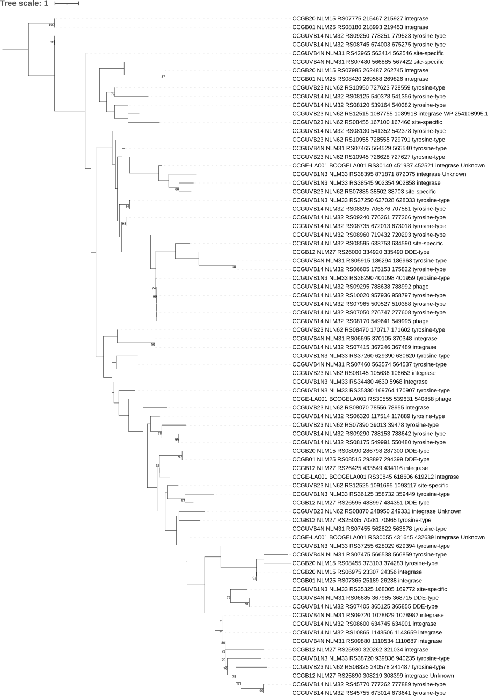

# Final_project_WBDS
Repositorio del proyecto final del Camp de WBDS

######  Uno de los descubrimientos destacados de la genómica bacteriana son las islas genómicas. Su papel en la patogenicidad es conocido en muchas bacterias, sin embargo, las islas simbióticas se han estudiado en menor medida. Las islas de simbiosis pueden transferirse entre bacterias relacionadas, se insertan en genes de ARNt específicos y tiene un contenido de GC más bajo que el resto de los genes cromosómicos. Las integrasas son una clave para la inserción de las islas simbióticas, reconocer si son específicas o no, es muy importante para entender su evolución. Recientemente [se publicaron](https://www.mdpi.com/1424-2818/14/7/518) nuevas genomospecies del género *Bradyrhizobium* y se sabe que contienen genes característicos de la simbiosis dentro de probables islas simbióticas.
######  **El objetivo de este proyecto es identificar las islas de simbiosis y la relación entre las integrasas que forman parte de estas**.   

###### Para lograr este objetivo, se realizaron los siguientes pasos:

0. Preparar el entorno de trabajo

1. Descargar los genomas de interés en formato GBK

2. Identificar las islas simbióticas mediante el software en linea [IslandViewer4](https://www.pathogenomics.sfu.ca/islandviewer) y determinar las coordenadas con la ayuda del visualizador en linea [Proksee](https://proksee.ca/projects).

3. Extraer la región correspondiente a la isla simbiótica de cada genoma y compararlas entre si mediante [clinker](https://github.com/gamcil/clinker) para estimar sus relaciones. 

4. Obtener las integrasas de la isla y hacer un análisis filogenético de estas.

   

La organización de este repositorio es la siguiente:

**`data`**  Directorio donde se almacenan los datos que sirven como entrada para cada análisis realizado

**`results`** Directorio en el que se almacenan los resultados obtenidos en cada análisis

**`Final_project.ipynb`** Jupyter Notebook con el flujo de trabajo y código ejecutado 

**`LICENSE`** Licencia de tipo Creative Commons Zero, con código abierto pero con protección de propiedad intelectual.

**`README.md`** Archivo README principal en el que se explica el objetivo del proyecto, el flujo de trabajo, los requistos de ejecución, estructura del repositorio, los resultados obtenidos y sus conclusiones

### 0. Preparación del entorno

Instalación de clinker en la terminal

```bash
conda create -n clinker -c conda-forge -c bioconda clinker-py
```

Instalación de librerías desde Jupyter Notebook

```python
#instalar biopython
!pip3 install biopython
!pip3 install pandas
```

Cargar librerías

```python
import pandas as pd
from Bio import SeqIO
from Bio import Entrez
```

## Flujo de trabajo

Se indica por número de apartado, dentro del archivo **Final_project.ipynb**, el flujo de trabajo seguido y la ubicación del código ejecutado.

### 1. Obtener los archivos gbk

**Apartado 1.1 **: Acceder a los archivos gbk se accedió a Entrez

**Apartado 1.2 **: Cargar la información de cada genoma de interés

**Apartado 1.3 **: Obtener los genomas en formato GBK

### 2. Identificar  las islas simbióticas

**Apartado 2.1 **:  Cargar los archivos gbk al software en linea [IslandViewer4](https://www.pathogenomics.sfu.ca/islandviewer) y detectar las islas simbióticas. Un ejemplo gráfico del resultado obtenido en IslandViewer se observa en la siguiente figura.


**Apartado 2.2 **: Cargar los gbk obtenidos al visualizador en linea [Proksee](https://proksee.ca/projects) y definir las coordenadas extendidas en un DataFrame.

### 3. Comparar las islas simbióticas entre los genomas de interés

 **Apartado 3.1 **: Cargar la información de la región correspondiente a cada isla simbiótica

 **Apartado 3.2 **: Definir una función que permita extraer una región del genoma dadas sus coordenadas y guardarla en un archivo gbk 

 **Apartado 3.3 **: Extraer la región de interés de cada genoma

**Apartado 3.4 **: Comparar las islas simbióticas de cada genoma, En este apartado, los archivos gbk correspondientes a la isla de simbiosis se compararon mediante [clinker](https://github.com/gamcil/clinker) en la terminal, pues se encuentra dentro de un ambiente conda.

```bash
conda activate clinker
clinker results/*.gbk -p Bradys_IS.html -mu results/Bradys_IS.matrix
```

El resultado obtenido se observa a continuación:


### 4. Obtener las integrasas de cada isla y estimar sus relaciones

**Apartado 4.1 **: Definir una función para convertir el gbk de las islas a multifasta de genes.

**Apartado 4.2**: Obtener un multifasta de genes del genoma de todas las cepas mediante un ciclo for.

**Apartado 4.3**: Definir una función para obtener sólo las secuencias de las integrasas.

**Apartado 4.4**: Obtener las secuencias de integrasas de las islas

**Apartado 4.[5,6,7]**: Estimar un árbol filogenético de las integrasas obtenidas.  Para esta sección se alinearon las secuencias mediante [MAFFT](https://mafft.cbrc.jp/alignment/server/) en línea y se refinó el alineamiento manualmente en la aplicación de [UGENE](http://ugene.net/). El modelo de sustitución y la filogenia se estimó mediante [IQtree](http://iqtree.cibiv.univie.ac.at/).

El árbol se observó y editó en [iTOL](https://itol.embl.de/).





## Conclusiones

* Se obtuvieron las secuencias de los genomas correspondientes al BioProject PRJNA842432 en formato GBK.Se detectaron las islas de simbiosis en cada genoma. 

* Se extrajo la región correspondiente a cada isla en formato GBK y estos se utilizaron para hacer un alineamiento que permitió comparar las islas entre los genomas analizados. Se pudo observar que las islas se agrupan en concordancia con el árbol filogenómico publicado junto con los genomas, por lo que las islas se conservan entre taxones. También se observó que existen algunos genes que se comparten entre las islas de todos los genomas, estos podrían corresponder a genes simbióticos como los de fijación de nitrógeno, nodulación o sistemas de secreción.

* Se analizaron las integrasas de todas las islas, para ello se generaron archivos multifasta de genes a partir de los gbk y se extrajeron las secuencias de interés. El alineamiento y la filogenia mostró una amplia diversificación y nula especificidad entre las integrasas de las islas de estos genomas. Se requieren análisis de clusterización más detallada para obtener una conclusión contundente.

  

### Extras

Adicionalmente se generararon los archivos de anotación GFF y un archivo de información consisa de cada gene de la isla.


