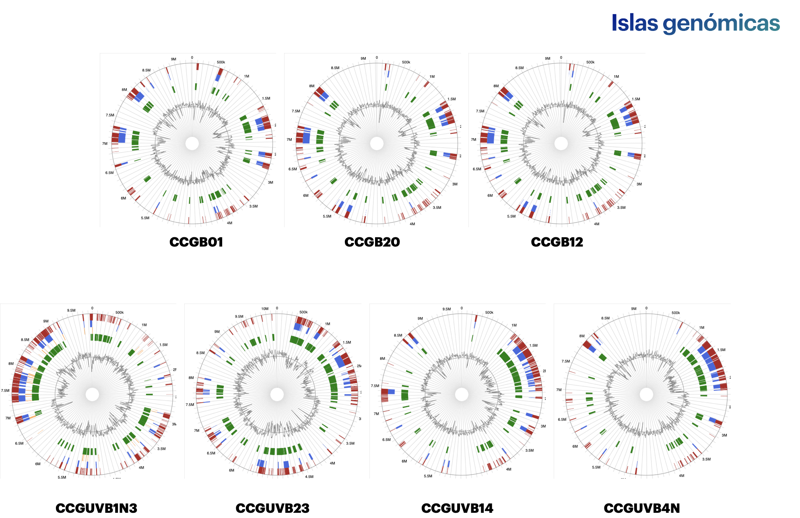
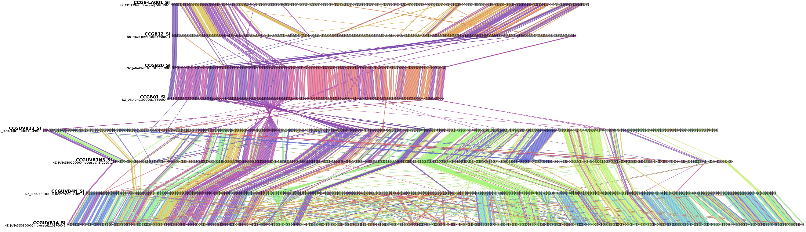

# Final_project_WBDS
Repositorio del proyecto final del Camp de WBDS

######  Uno de los descubrimientos destacados de la genómica bacteriana son las islas genómicas. Su papel en la patogenicidad es conocido en muchas bacterias, sin embargo, las islas simbióticas se han estudiada en menor medida. Las islas de simbiosis pueden transferirse entre bacterias relacionadas, se insertan en genes de ARNt específicos y tiene un contenido de GC más bajo que el resto de los genes cromosómicos. 
Las integrasas son una clave para la inserción de las islas simbióticas, reconocer si son específicas o no, es muy importante para entender la evolución de las islas. Recientemente [se publicaron](https://www.mdpi.com/1424-2818/14/7/518) nuevas genomospecies del género *Bradyrhizobium* y se sabe que contienen genes característicos de la simbiosis dentro de probables islas simbióticas.

######  El objetivo de este proyecto es identificar las islas de simbiosis y la relación entre las integrasas que forman parte de estas.   

###### Para lograr este objetivo, se realizaron los siguientes pasos:

0. Preparar el entorno de trabajo

1. Descargar los genomas de interés en formato GBK
2. Identificar las islas simbióticas mediante el software en linea [IslandViewer4](https://www.pathogenomics.sfu.ca/islandviewer).
3. Extraer la región correspondiente a la isla simbiótica de cada genoma y compararlas entre si mediante [clinker](https://github.com/gamcil/clinker) para estimar sus relaciones. 
4. Obtener las integrasas de la isla y hacer un análisis filogenético de las integrasas obetnidas.

##### Preparación del entorno

Instalación de clinker

```bash
conda create -n clinker -c conda-forge -c bioconda clinker-py
```

Instalación de librerías

```python
#instalar biopython
!pip3 install biopython
!pip3 install pandas
```

Cargar librerías

```python
import pandas as pd
from Bio import SeqIO
from Bio import Entrez
```

##### Obtener los archivos gbk

Para acceder a los archivos gbk se accedió a Entrez de la siguiente forma:

```python
#acceso a entrez
Entrez.email = "hoaxaca@ccg.unam.mx"  # IMPORTANTE!!!
# handle con einfo
handle = Entrez.einfo()
result = handle.read() 
handle.close()
#chequemos qué hay en einfo
print(result)
```

Los números de acceso para obtener los genomas de interés se encuentran en el archivo PRJNA842432_AssemblyDetails.tsv ubicado en el directorio `data/`. Se cargó el DataFrame y se obtuvieron los archivos GBK de los genomas de interés de la siguiente forma:

```python
#cargar el DataFrame
genomes = pd.read_csv("data/PRJNA842432_AssemblyDetails.tsv", sep = "\t")

#Obtener los GenBank de los genomas de interés
for i, accession in enumerate(genomes["WGS"]):
    strain = genomes["Strain"][i]
    out = "data/gbk_ncbi" + strain + ".gbk"
    handle = Entrez.efetch(db="nucleotide", id=accession, rettype="gb", retmode="text")
    record = SeqIO.read(handle, "genbank")
    handle.close()
    SeqIO.write(record, out, "genbank")
    print("Archivo GenBank generado para la cepa:", strain)
```

##### Identificar  las islas simbióticas

Se cargaron los archivos gbk al software en linea [IslandViewer4](https://www.pathogenomics.sfu.ca/islandviewer), se detectaron las islas simbióticas. Un ejemplo gráfico del resultado obtenido en IslandViewer se observa en la siguiente figura.




 Posteriormente se definieron las coordenadas extendidas en un DataFrame.

##### Extraer la región correspondiente a la isla simbiótica de cada genoma y compararlas entre si para estimar relaciones. 

```python
#Cargar el DataFrame con las coordenadas de las islas simbióticas
coordinates = pd.read_csv("data/coordinates_islands.tsv", sep="\t")
coordinates
```

```python
# Definir función para extraer región
def extraer_region_gbk(gbk_file, start, end, output_file):
    record = SeqIO.read(gbk_file, "genbank")
    region = record[start-1:end]    
    # Modificar los nombres de los CDS e incluir la posición
    for feature in region.features:
        if feature.type == "CDS":
            feature.qualifiers["locus_tag"][0] += f"_{feature.location.start.position}_{feature.location.end.position}"
    with open(output_file, "w") as out:
        SeqIO.write(region, out, "genbank")
```

```python
#Extraer las regiones de cada cepa
for s, names in enumerate(coordinates['strain']):
    strain = coordinates['strain'][s]
    input_file = "data/gbk_island_viewer/" + strain + ".gbk"
    start_position = coordinates['start'][s]
    end_position = coordinates['end'][s]
    output_file = "results/" + strain + "_SI.gbk"
    extraer_region_gbk(input_file, start_position, end_position, output_file)
    print("Archivo GenBank extraido de la cepa:", strain)
```

Los archivos gbk correspondientes a la isla de simbiosis se compararon mediante [clinker](https://github.com/gamcil/clinker) en la terminal, pues se encuentra dentro de un ambiente conda.

```bash
conda activate clinker
clinker results/*.gbk -p Bradys_IS.html -mu results/Bradys_IS.matrix
```

El resultado obtenido se observa a continuación:




##### Obtener las integrasas de cada isla y estimar sus relaciones

Para poder obtener las secuencias de las integrasas de cada isla se conviertió el archivo gbk a formato fasta.

```python
#Definir la función para convertir el gbk a multifasta de genes
def gbk_to_ffn(input_file, output_file):
    records = list(SeqIO.parse(input_file, "genbank"))
    df = pd.DataFrame(columns=["ID", "Sequence"])
    strain = []
    for record in records:
        strain.append(record.description.split(' ')[2])
        strain = strain[0]
        for feature in record.features:
            if feature.type == "gene":
                # Extraer el identificador del gene y la secuencia del gen
                #gene_id = feature.qualifiers.get("gene", ["Unknown"])[0]
                gene_seq = feature.extract(record.seq)
            elif feature.type == "CDS":
                gene_accession = feature.qualifiers.get("locus_tag", ["Unknown"])[0]
                product = feature.qualifiers.get("product", ["Unknown"])[0]
                protein_id = feature.qualifiers.get("protein_id", ["Unknown"])[0]
                header = strain + "_" + gene_accession + "_" + product + "_" + protein_id
                # Añadir el identificador y la secuencia del gene al DataFrame
                df = df.append({"ID": header, "Sequence": gene_seq}, ignore_index=True)
        # Escribir el DataFrame en un archivo multifasta
        with open(output_file, "w") as output_handle:
            for _, row in df.iterrows():
                output_handle.write(">" + row["ID"] + "\n" + str(row["Sequence"]) + "\n")
```

```python
#Obtener el multifasta de genes de todas las cepas
for s, names in enumerate(coordinates['strain']):
    strain = coordinates['strain'][s]
    input_file = "results/" + strain + "_SI.gbk"
    output_file = "results/" + strain + "_SI.ffn"
    gbk_to_ffn(input_file, output_file)
    print(f"Se convirtió de gbk a multifasta de genes de la cepa {strain}, el resultado se guardó en el archivo {output_file}")
```

Posteriormente se obtuvieron las secuencias correspondientes a integrasas.

```python
#Extraer las secuencias de nucleotidos de las integrasas 
def get_integrases(input_file, output_file):
    with open(output_file, "w") as out_handle:
        for record in SeqIO.parse(input_file, "fasta"):
            if "integrase" in record.description:
                SeqIO.write(record, out_handle, "fasta")
#Obtener el multifasta de genes de todas las cepas
for s, names in enumerate(coordinates['strain']):
    strain = coordinates['strain'][s]
    input_file = "results/" + strain + "_SI.ffn"
    output_file = "results/" + strain + "_SI_integrases.fasta"
    get_integrases(input_file, output_file)
    print(f"Se extrajeron las secuencias de integrasas de la cepa {strain}, dentro del archivo {output_file}")
```

##### Extras

Adicionalmente se generararon los archivos de anotación GFF y un archivo de información consisa de cada gene de la isla.

```python
#Definir una función para convertir el gbk a gff Esto para futuros analisis
from Bio import SeqIO

def gbk_to_gff(input_file, output_file):
    with open(output_file, "w") as f_gff:
        for record in SeqIO.parse(input_file, "genbank"):
            for feature in record.features:
                if feature.type != "Misc":
                    start = feature.location.start.position
                    end = feature.location.end.position
                    strand = feature.location.strand
                    attributes = ",".join(
                        f"{key}={value}" for key, value in feature.qualifiers.items()
                    )
                    line = "\t".join(
                        [
                            record.id,
                            feature.type,
                            str(start),
                            str(end),
                            ".",
                            "+" if strand == 1 else "-",
                            ".",
                            attributes,
                        ]
                    )
                    f_gff.write(line + "\n")
```

```python
#Obtener los gff de la isla de cada cepa

for s, names in enumerate(coordinates['strain']):
    strain = coordinates['strain'][s]
    input_file = "results/" + strain + "_SI.gbk"
    output_file = "results/" + strain + "_SI.gff"
    gbk_to_gff(input_file, output_file)
    print(f"Se convirtió de gbk a gff de la cepa {strain}, el resultado se guardó en el archivo {output_file}")
```

```python
#Definir una función para obtener informacion de cada feature
def feature_info(input_file, output_file):
    data = []
    for record in SeqIO.parse(input_file, "genbank"):
        for feature in record.features:
            if feature.type == "gene":
                locus_tag_gene = feature.qualifiers.get("locus_tag", ["???"])[0]
            elif feature.type == "CDS":
                locus_tag = feature.qualifiers.get("locus_tag", ["???"])[0]
                product = feature.qualifiers.get("product", ["???"])[0]
                sequence = feature.qualifiers.get("translation")
                data.append([locus_tag_gene, locus_tag, product])
    # Recorrer el archivo GenBank nuevamente para extraer otros datos
    for record in SeqIO.parse("results/CCGB01_SI.gbk", "genbank"):
        for feature in record.features:
            if feature.type == "tRNA":
                tRNA_locus_tag = feature.qualifiers.get("locus_tag", ["???"])[0]
                tRNA_product = feature.qualifiers.get("product", ["???"])[0]
                data.append([tRNA_locus_tag, tRNA_product])
    # Crear un DataFrame a partir de los datos almacenados en la lista
    df = pd.DataFrame(data, columns=["Locus_Tag_Gene", "Locus_Tag", "Product"])
    df.to_csv(output_file, index=False)
```

```python
#Obtener un DataFrame con la información principal de los features de la isla

for s, names in enumerate(coordinates['strain']):
    strain = coordinates['strain'][s]
    input_file = "results/" + strain + "_SI.gbk"
    output_file = "results/" + strain + "_SI_info.csv"
    feature_info(input_file, output_file)
    print(f"Se extrajo información de cada feature de la {strain}, el resultado se guardó en el archivo {output_file}")
```
